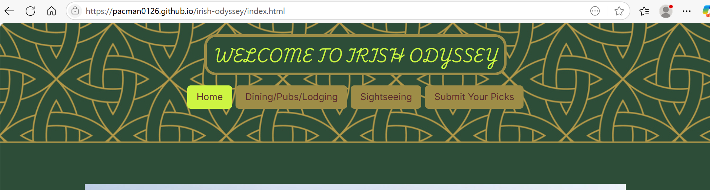
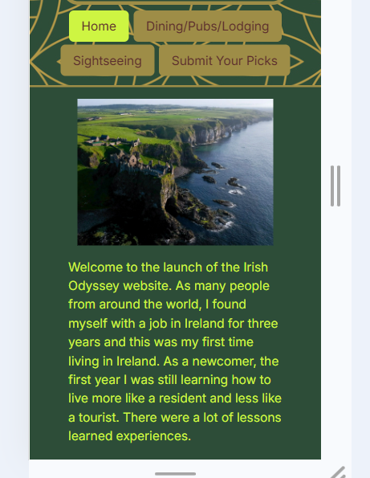
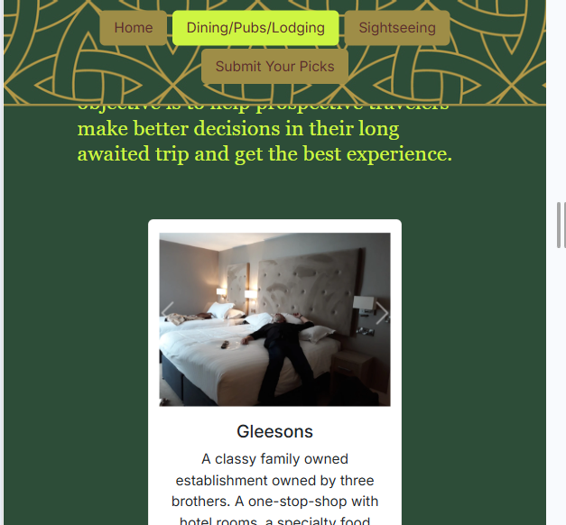
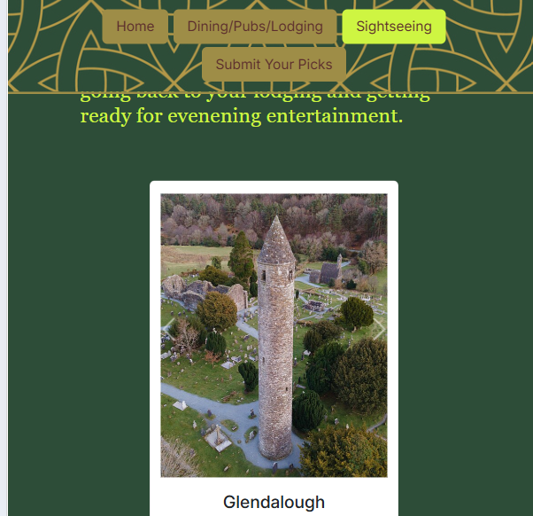
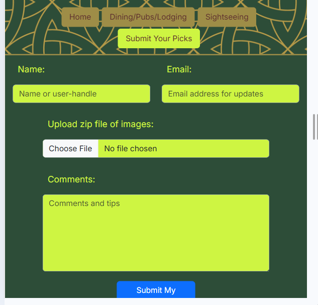
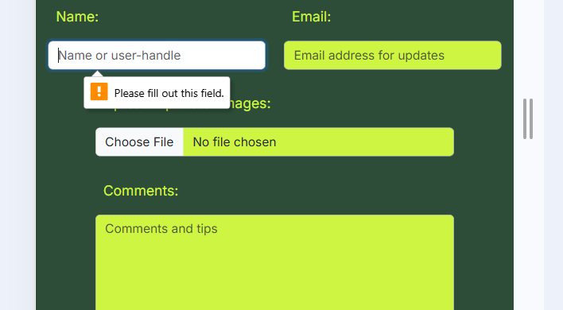
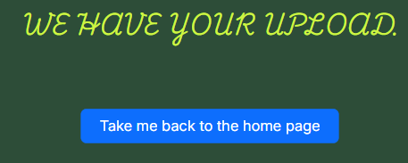

# irish-odyssey
portfolio-1 project

## Description
The Irish Odyssey is a new launch website. It is intended to help first time visitors who have a 7-10 day short vacation to get the most out of their trip. It is to collect the personal experiences of local Irish residents and frequent visitors who have positive personal experiences at hotels/B&B's etc., and sightseeing ideas. Users can upload their images, comments, tips, lessons learned and other helpful info. This is to help prospective visitors save hours and hours of online surfing in planning and booking only to have buyer's remorse. The goal is to reduce first time visitor travel stress and give them a solid footing and room to explore other things to do at their liesure.

## Features
1. Pill driven navigation

2. Home page with intro and mission statement

3. Dining, pubs and lodging page with cards of user uploads of recommended lodging

4. Sightseeing page with cards of user uploads of recommended sightseeing ideas.

5. Upload form page

6. Input validation

7. Take me back home button

8. Form Submit button

## How to View the Project
- [View the deployed website](https://pacman0126.github.io/irish-odyssey/index.html)

## Credits

Images were used from these websites

- (https://travelwithwes.com/post/beautiful-ireland-landscapes)
- (https://www.istockphoto.com/de/vektor/keltischer-knoten-nahtlose-muster-gm1130565676-299051475?searchscope=image%2Cfilm
)
- (https://lh3.googleusercontent.com/p/AF1QipOjEHL7UJeupKfEW_Z_YpHrnK9qk2RgueLBfYOA=s1360-w1360-h1020-rw
)
- (https://www.google.com/search?q=booterstown+gleesons&sca_esv=87b41ab4477c98ab&sxsrf=AE3TifMHF00HH3IEO2IOqWQmD9s_E5hJbg%3A1749215004211&source=hp&ei=HOdCaK_qCpipxc8P3uSxuQ0&iflsig=AOw8s4IAAAAAaEL1LDu9zMPV5ZUPD5vG49hux_PZeB6m&gs_ssp=eJzj4tFP1zc0rEjJMDIxyzFgtFI1qDCxMDM3sEgxN02zTDIxMrS0MqgwNkhMTDVNMUhONrMwTk4z8hJJys8vSS0qLskvz1NIz0lNLc7PKwYAEDkW3w&oq=booterstown+g&gs_lp=Egdnd3Mtd2l6Ig1ib290ZXJzdG93biBnKgIIADIXEC4YgAQYkQIYxwEYmAUYmQUYigUYrwEyBRAAGIAEMgUQABiABDIFEAAYgAQyBRAAGIAEMgYQABgWGB4yBhAAGBYYHjIGEAAYFhgeMgYQABgWGB4yBhAAGBYYHkjNpAFQ0xRYu0xwAXgAkAEAmAGXAaAB_AyqAQQwLjEzuAEByAEA-AEBmAIOoALTDagCCsICBxAjGCcY6gLCAgoQIxiABBgnGIoFwgIEECMYJ8ICCxAuGIAEGJECGIoFwgIREC4YgAQYkQIY0QMYxwEYigXCAgUQLhiABMICCxAuGIAEGNEDGMcBwgIREC4YgAQYkQIYxwEYigUYrwHCAgsQLhiABBjHARivAcICERAuGIAEGMcBGJgFGJkFGK8BwgIKEAAYgAQYFBiHAsICEBAuGIAEGBQYhwIYxwEYrwHCAgsQABiABBiRAhiKBcICEBAuGIAEGEMYxwEYigUYrwHCAgoQABiABBhDGIoFmAMI8QWVSXLej3bBGJIHBDEuMTOgB4OyAbIHBDAuMTO4B8sNwgcHMC41LjYuM8gHSw&sclient=gws-wiz#lpg=ik:CAoSLEFGMVFpcE9qRUhMN1VKZXVwS2ZFV19aX1lwSHJuSzlxazJSZ3VlTEJmWU9B)

- (https://glendalough.ie/nggallery/slideshow)
- (https://en.wikipedia.org/wiki/Glendalough)
- (https://commons.wikimedia.org/w/index.php?curid=15258247)
- (https://www.flickr.com/photos/shadowgate/2808713125/)
- (https://commons.wikimedia.org/w/index.php?curid=34965684)

