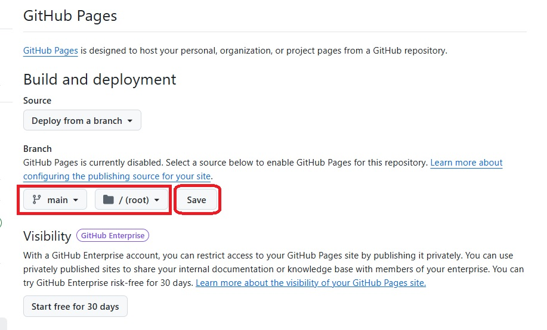
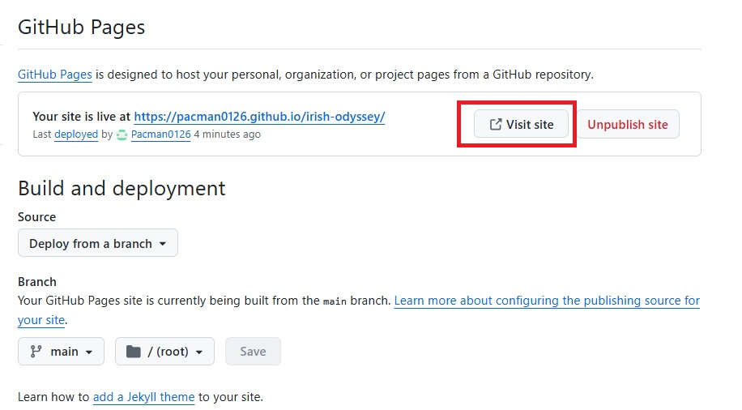

# irish-odyssey
portfolio-1 project

## Description
The Irish Odyssey is a new launch website. It is intended to help first time visitors who have a 7-10 day short vacation to get the most out of their trip. It is to collect the personal experiences of local Irish residents and frequent visitors who have positive personal experiences at hotels/B&B's etc., and sightseeing ideas. Users can upload their images, comments, tips, lessons learned and other helpful info. This is to help prospective visitors save hours and hours of online surfing in planning and booking only to have buyer's remorse. The goal is to reduce first time visitor travel stress and give them a solid footing and room to explore other things to do at their liesure.

## Features
1. Pill driven navigation

2. Home page with intro and mission statement

3. Dining, pubs and lodging page with cards of user uploads of recommended lodging

4. Sightseeing page with cards of user uploads of recommended sightseeing ideas.


5. Upload form page


6. Input validation


7. Take me back home button


8. Form Submit button


# Deploying Irish Odyssey to GitHub Pages

This guide walks through deploying your project to GitHub Pages.

---

## 1) Push (or update) your repo on GitHub

If you haven't yet pushed this project to GitHub, run the following commands:

<!-- ```bash -->
# from your project root
- git init                      # skip if already a git repo
- git add .
- git commit -m "Initial commit"
- git branch -M main
- git remote add origin https://github.com/Pacman0126/irish-odyssey.git
- git push -u origin main

## 2) Enable GitHub Pages (quick method)

1. On GitHub, open your repository.  
2. Go to **Settings → Pages** (under *Code and automation*).


 

3. Under **Build and deployment**, choose **Deploy from a branch**.  
4. Select:  
   - **Branch**: `main` 
   - **Folder**: `/ (root)` or `/docs` (depending on where your `index.html` lives).

    

5. Click **Save**.  
6. Click Vist Site button. GitHub will show the published URL (e.g., `https://Pacman0126.github.io/irish-odyssey/`).

    


## How to View the Project
- [View the deployed website](https://pacman0126.github.io/irish-odyssey/index.html)


## Testing and Validation

### HTML Validation
- [Home Page](https://validator.w3.org/nu/?doc=https://pacman0126.github.io/irish-odyssey)
- [Dining, Pubs & Lodging](https://validator.w3.org/nu/?doc=https://pacman0126.github.io/irish-odyssey/dining-pubs-lodging.html)
- [Sightseeing](https://validator.w3.org/nu/?doc=https://pacman0126.github.io/irish-odyssey/sightseeing.html)
- [Submit Confirmation](https://validator.w3.org/nu/?doc=https://pacman0126.github.io/irish-odyssey/submit-confirmation.html)
- [Submit Ideas](https://validator.w3.org/nu/?doc=https://pacman0126.github.io/irish-odyssey/submit-ideas.html)

### CSS Validation
- [CSS Validator](https://jigsaw.w3.org/css-validator/validator?uri=https://pacman0126.github.io/irish-odyssey)

---

### Manual Testing

#### 📋 Summary of User Flows

| Page | User Action | Expected Result | Status |
|------|-------------|-----------------|--------|
| **Home** (`index.html`) | Site loads | Home page is displayed | ✅ |
| **Dining, Pubs & Lodging** | Click button | Navigates to `dining-pubs-lodging.html` | ✅ |
| **Sightseeing** | Click button | Navigates to `sightseeing.html` | ✅ |
| **Submit Ideas** | Click button | Navigates to `submit-ideas.html` | ✅ |
| Submit Ideas – File Upload | Click **Choose File** | Windows Explorer opens | ✅ |
| Submit Ideas – Form Validation | Submit with missing fields | Validation warnings shown | ✅ |
| Submit Ideas – Successful Submission | Submit with all fields completed | Confirmation displayed | ✅ |
| **Submit Confirmation** | Click **Take me back to the home page** | Redirects to Home page | ✅ |

---

#### 🔎 Detailed Walkthrough with Screenshots

##### Home Page (`index.html`)
- When site loads, user sees the Home page.  
  ✅ Behaves as expected.  
  

##### Dining, Pubs & Lodging (`dining-pubs-lodging.html`)
- Clicking **Dining/Pubs/Lodging** button takes user to this page.  
  ✅ Behaves as expected.  
  

##### Sightseeing (`sightseeing.html`)
- Clicking **Sightseeing** button takes user to this page.  
  ✅ Behaves as expected.  
  

##### Submit Ideas (`submit-ideas.html`)
- Clicking **Submit Your Picks** button takes user to this page.  
  ✅ Behaves as expected.  
  

###### File Upload
- Clicking **Choose File** opens Windows Explorer.  
  ✅ Behaves as expected.  
    
  

###### Form Validation
- Submitting with missing fields triggers validation warnings.  
  ✅ Behaves as expected.  
  

- Submitting with all fields completed shows confirmation.  
  ✅ Behaves as expected.  
  

##### Submit Confirmation (`submit-confirmation.html`)
- Clicking **Take me back to the home page** button redirects user to Home page.  
  ✅ Behaves as expected.  
  


## Credits

Images were used from these websites

- (https://travelwithwes.com/post/beautiful-ireland-landscapes)
- (https://www.istockphoto.com/de/vektor/keltischer-knoten-nahtlose-muster-gm1130565676-299051475?searchscope=image%2Cfilm
)
- (https://lh3.googleusercontent.com/p/AF1QipOjEHL7UJeupKfEW_Z_YpHrnK9qk2RgueLBfYOA=s1360-w1360-h1020-rw
)
- (https://www.google.com/search?q=booterstown+gleesons&sca_esv=87b41ab4477c98ab&sxsrf=AE3TifMHF00HH3IEO2IOqWQmD9s_E5hJbg%3A1749215004211&source=hp&ei=HOdCaK_qCpipxc8P3uSxuQ0&iflsig=AOw8s4IAAAAAaEL1LDu9zMPV5ZUPD5vG49hux_PZeB6m&gs_ssp=eJzj4tFP1zc0rEjJMDIxyzFgtFI1qDCxMDM3sEgxN02zTDIxMrS0MqgwNkhMTDVNMUhONrMwTk4z8hJJys8vSS0qLskvz1NIz0lNLc7PKwYAEDkW3w&oq=booterstown+g&gs_lp=Egdnd3Mtd2l6Ig1ib290ZXJzdG93biBnKgIIADIXEC4YgAQYkQIYxwEYmAUYmQUYigUYrwEyBRAAGIAEMgUQABiABDIFEAAYgAQyBRAAGIAEMgYQABgWGB4yBhAAGBYYHjIGEAAYFhgeMgYQABgWGB4yBhAAGBYYHkjNpAFQ0xRYu0xwAXgAkAEAmAGXAaAB_AyqAQQwLjEzuAEByAEA-AEBmAIOoALTDagCCsICBxAjGCcY6gLCAgoQIxiABBgnGIoFwgIEECMYJ8ICCxAuGIAEGJECGIoFwgIREC4YgAQYkQIY0QMYxwEYigXCAgUQLhiABMICCxAuGIAEGNEDGMcBwgIREC4YgAQYkQIYxwEYigUYrwHCAgsQLhiABBjHARivAcICERAuGIAEGMcBGJgFGJkFGK8BwgIKEAAYgAQYFBiHAsICEBAuGIAEGBQYhwIYxwEYrwHCAgsQABiABBiRAhiKBcICEBAuGIAEGEMYxwEYigUYrwHCAgoQABiABBhDGIoFmAMI8QWVSXLej3bBGJIHBDEuMTOgB4OyAbIHBDAuMTO4B8sNwgcHMC41LjYuM8gHSw&sclient=gws-wiz#lpg=ik:CAoSLEFGMVFpcE9qRUhMN1VKZXVwS2ZFV19aX1lwSHJuSzlxazJSZ3VlTEJmWU9B)

- (https://glendalough.ie/nggallery/slideshow)
- (https://en.wikipedia.org/wiki/Glendalough)
- (https://commons.wikimedia.org/w/index.php?curid=15258247)
- (https://www.flickr.com/photos/shadowgate/2808713125/)
- (https://commons.wikimedia.org/w/index.php?curid=34965684)

